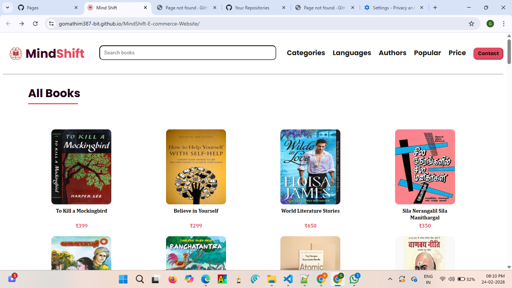
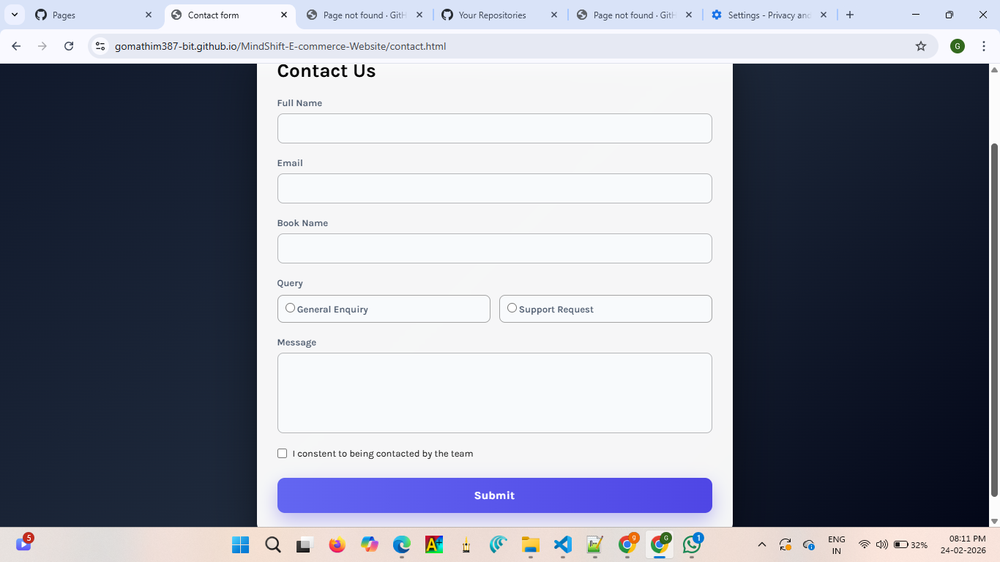
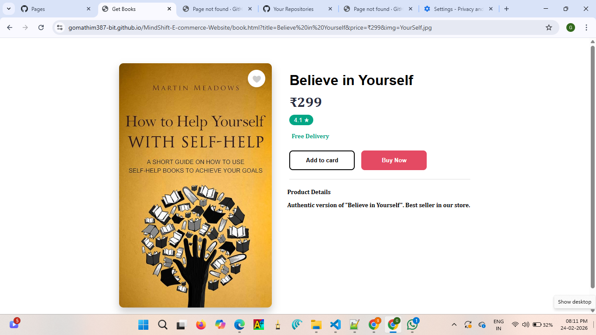

# MindShift E-commerce Website

## 📌 Project Description
This is a responsive e-commerce website built using HTML, CSS, and JavaScript.  
The project showcases a clean UI, product display sections, and basic website navigation.

## 🌐 Live Demo
🔗 https://gomathim387-bit.github.io/MindShift-E-commerce-Website/

## 🛠 Technologies Used
- HTML5
- CSS3
- JavaScript

## 👩‍💻 Author
**Gomathi**  
Frontend Developer (Beginner)  

🔗 GitHub: https://github.com/gomathim387-bit  

## 📸 Screenshots

## 🚀 How to Run Locally
1. Download or clone the repository  
2. Open `index.html` in your browser  

## 🎯 Project Purpose
This project was created to practice and improve my frontend development skills.

## 🔮 Future Improvements
- Add shopping cart functionality  
- Add user login system  
- Connect the project to a backend database  